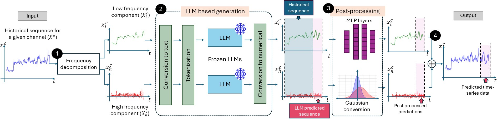

# llmpred-code
This is the repository for LLMPred paper and **currently being updated**.

# Abastract of LLMPred
Time-series prediction or forecasting is critical across many real-world dynamic systems, and recent studies have proposed using Large Language Models (LLMs) for this task due to their strong generalization capabilities and ability to perform well without extensive pre-training.
However, their effectiveness in handling complex, noisy, and multivariate time-series data remains underexplored. To address this, we propose LLMPred which enhances LLM-based time-series prediction by converting time-series sequences into text and feeding them to LLMs for zero-shot prediction along with two main data pre-processing techniques. First, we apply time-series sequence decomposition to facilitate accurate prediction on complex and noisy univariate sequences. Second, we extend this univariate prediction capability to multivariate data using a lightweight prompt-processing strategy. Extensive experiments with smaller LLMs such as Llama 2 7B, Llama 3.2 3B, GPT-4o-mini, and DeepSeek 7B demonstrate that LLMPred achieves competitive or superior performance compared to state-of-the-art baselines. Additionally, a thorough ablation study highlights the importance of the key components proposed in LLMPred. 

# Overview of LLMpred process

# Dataset
Intermediate datasets including input to the LLM and other models and their outputs can be found at [Dataset](https://drive.google.com/drive/folders/1z3gY4nfkHPGF0JJcoKwRQCS3fYjstGkj?usp=sharing).

# Requirements

# Run the code

## Univariate analysis

## Multivariate analysis
